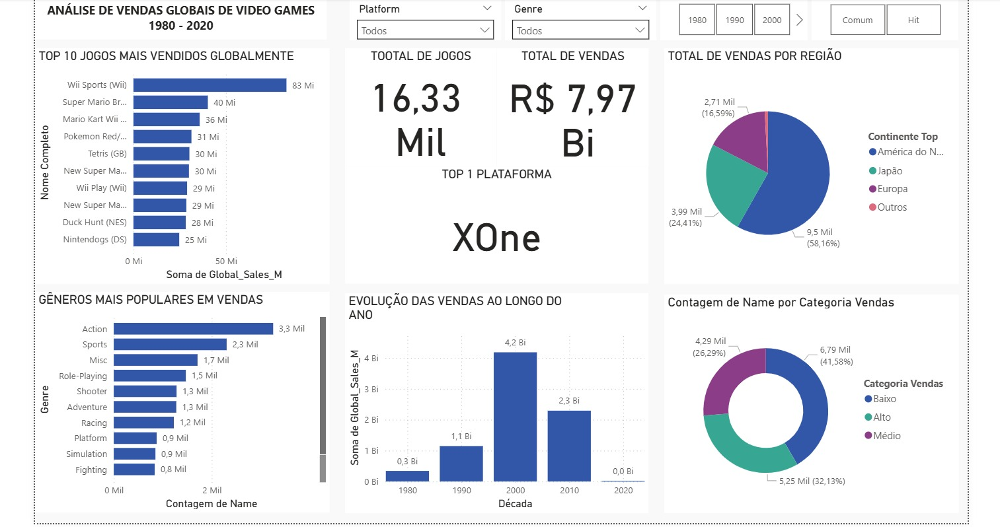

# 🎮 Dashboard de Vendas de Video Games - Power BI

Projeto final da disciplina **Mineração de Dados e Business Intelligence**, com foco na construção de um dashboard interativo no Power BI a partir de uma base pública de vendas de jogos.

---

## 👨‍💻 Autor

- **Leonardo Coelho**

---

## 📊 Resumo do Projeto

Este projeto tem como objetivo transformar uma base de dados de vendas de vídeo games em **insights de negócio**, utilizando ferramentas de análise e visualização no **Power BI**. Foram aplicadas técnicas de:

- Limpeza de dados
- Criação de colunas e medidas com DAX
- Segmentações visuais por filtros e categorias
- Design informativo e responsivo

---

## 📌 Base de Dados

- Fonte: Kaggle  
  [🎯 Video Game Sales Dataset – Kaggle](https://www.kaggle.com/datasets/anandshaw2001/video-game-sales)
- Formato original: `.csv`
- Dados sobre: nome do jogo, plataforma, ano de lançamento, gênero, publisher, e vendas por região

---

## ❓ Perguntas de Negócio Respondidas

1. Quais são os 10 jogos mais vendidos globalmente?  
2. Qual o gênero com maior volume de vendas globais?  
3. Quais são as plataformas com maior volume total de vendas?  
4. Qual o volume de vendas por região (América do Norte, Europa, Japão, Outros)?  
5. Qual o total de jogos em cada categoria de vendas (Alta, Média, Baixa)?  
6. Qual a média de vendas globais por jogo?  
7. Como as vendas se comportaram ao longo dos anos?  
8. Qual é a participação da Nintendo nas vendas totais?  
9. Quais gêneros concentram os maiores volumes de vendas?  
10. Quantos jogos compõem a base de dados analisada?

---

## 🖼️ Visual do Dashboard

> 📌 Imagem ilustrativa — versão completa disponível para download.

---

## 📁 Arquivos Disponíveis

| Tipo | Nome | Descrição |
|------|------|-----------|
| 📊 | `Dashboard.pbix` | Dashboard editável no Power BI Desktop |
| 🗂️ | `Dados.csv` | Base de dados original utilizada no projeto |
| 📷 | `Print.png` | Documentação com objetivo e contexto do projeto |

---

## 🛠️ Ferramentas Utilizadas

- Power BI Desktop (modelagem e visualização)
- DAX (cálculos e medidas)
- Excel / Power Query (limpeza dos dados)
- Kaggle (fonte dos dados)

---

## ✅ Como Executar o Projeto

1. Baixe o arquivo `.pbix`
2. Abra com o Power BI Desktop
3. Interaja com os filtros e visualizações para explorar os dados

---

## 💬 Contato

📧 lnrds.coelho@gmail.com
🔗 [LinkedIn](https://www.linkedin.com/in/leoscoelho/)

---

> Projeto acadêmico com aplicação prática para análise de dados reais com foco em **business intelligence e storytelling visual**.
